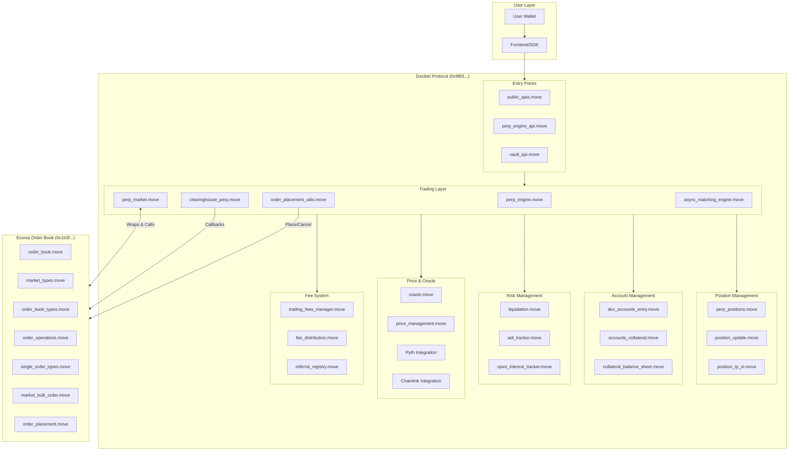
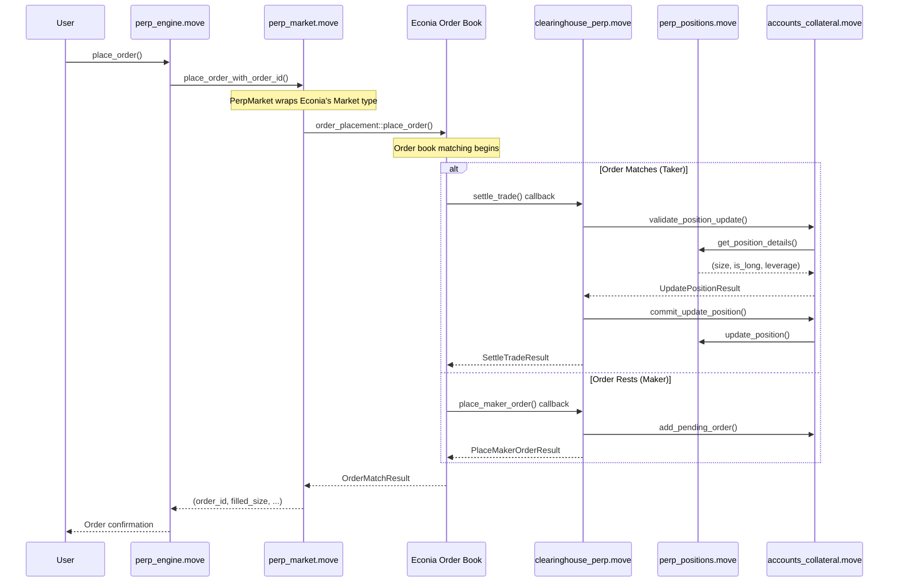
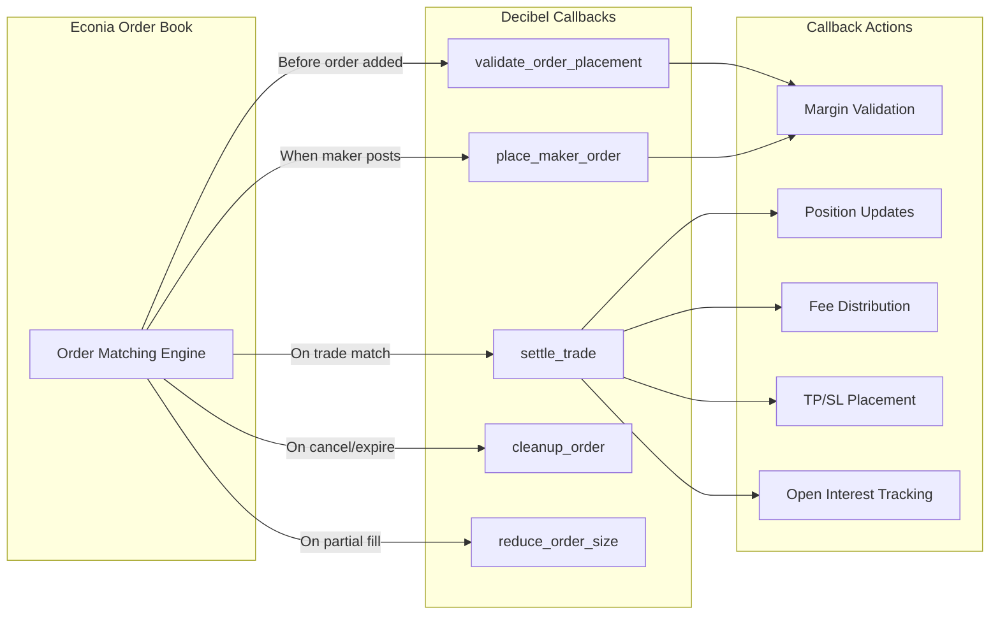
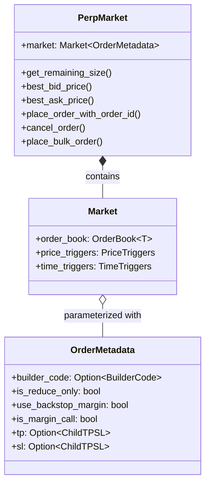
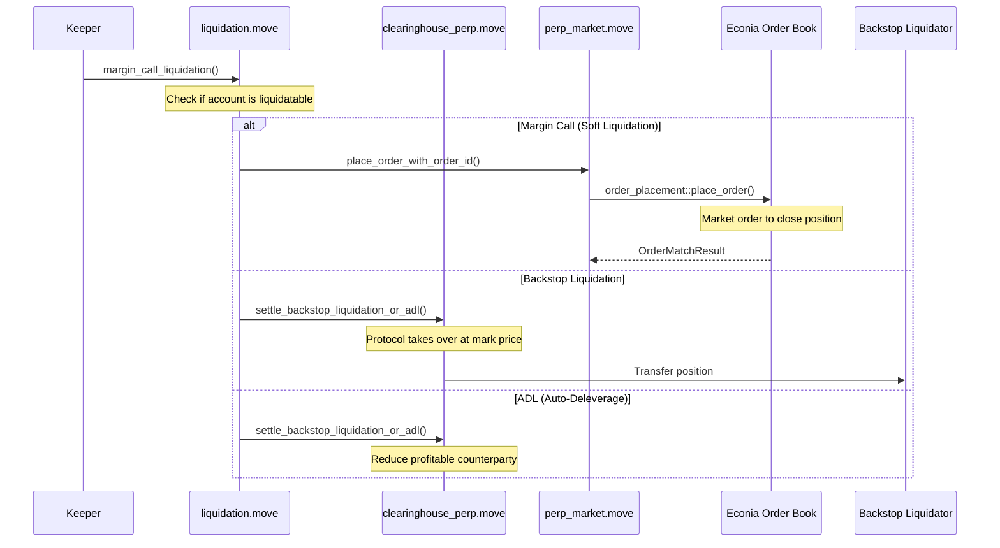
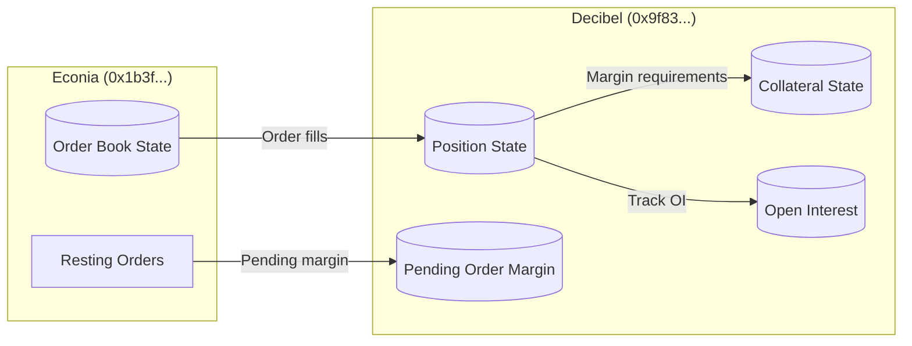

# Decibel Protocol Architecture

This document describes how the Decibel perpetual DEX protocol interacts with the Econia order book infrastructure.

## Contract Addresses

| Contract | Address | Network | Deployed |
|----------|---------|---------|----------|
| **Decibel Protocol** (Current) | `0xd0b2dd565e0f2020d66d581a938e7766b2163db4b8c63410c17578d32b4e9e88` | Aptos Testnet | Jan 21, 2026 |
| **Decibel Protocol** (Previous) | `0x9f830083a19fb8b87395983ca9edaea2b0379c97be6dfe234bb914e6c6672844` | Aptos Testnet | Dec 2025 |
| **Econia Order Book** (Decibel's fork) | `0x1b3fa27b03773a4265a09b292c5059da10b4ae8a3dbd2972245c7504e89f52e7` | Aptos Testnet | Dec 16, 2025 |

> **Note:** The Econia contract at `0x1b3f...` is a redeployment of Econia's open-source order book code by Aptos Labs specifically for Decibel. It is NOT the original Econia testnet deployment.

## Recent Changes (Jan 21, 2026 Testnet Reset)

- **New Contract Address:** `0xd0b2...` replaces `0x9f83...`
- **New Module:** `dex_accounts_entry` added as wrapper with entry functions for trading
- **New Modules:** `vault_api`, `order_apis`, `account_management_apis`, `predeposit`, `slippage_math`, `work_unit_utils`, `position_view_types`, `perp_order`
- **Primary Subaccount Derivation:** Now uses `GlobalSubaccountManager` + BCS-encoded seed
- **API Changes:** List endpoints now return `{items: [], total: x}` format
- **SDK Version:** Updated to 0.2.9

## High-Level Architecture



## Order Flow: User Places a Trade



## The Callback Architecture

Decibel uses a callback pattern to integrate with Econia. The order book invokes callbacks during matching to let Decibel handle:



## Econia Modules Used by Decibel

| Econia Module | Decibel Usage | Description |
|--------------|---------------|-------------|
| `order_book` | `perp_market.move` | Core order book queries (remaining size, slippage price) |
| `market_types` | `perp_market.move`, `clearinghouse_perp.move` | Market and callback types |
| `order_book_types` | Throughout | Order IDs, TimeInForce, TriggerCondition |
| `order_placement` | `perp_market.move`, `order_placement_utils.move` | Placing orders on the book |
| `order_operations` | `perp_market.move` | Cancel, decrease size operations |
| `single_order_types` | `perp_market.move`, `perp_engine.move` | Single order data structures |
| `market_bulk_order` | `perp_market.move` | Market maker bulk order operations |
| `market_clearinghouse_order_info` | `clearinghouse_perp.move` | Order info for callbacks |

## The PerpMarket Wrapper

The key integration point is `perp_market.move`, which wraps Econia's generic `Market` type:



## Trade Settlement Flow

```mermaid
flowchart TB
    subgraph SettleTrade["settle_trade() in clearinghouse_perp.move"]
        Validate[Validate both sides can settle]
        ReduceOnly[Check reduce-only constraints]
        OICap[Check open interest cap]
        TakerUpdate[Validate taker position update]
        MakerUpdate[Validate maker position update]
        CommitTaker[Commit taker position]
        CommitMaker[Commit maker position]
        DistributeFees[Distribute fees]
        PlaceTPSL[Place child TP/SL orders]
        UpdateOI[Update open interest]
    end

    Validate --> ReduceOnly
    ReduceOnly --> OICap
    OICap --> TakerUpdate
    TakerUpdate --> MakerUpdate
    MakerUpdate --> CommitTaker
    CommitTaker --> CommitMaker
    CommitMaker --> DistributeFees
    DistributeFees --> PlaceTPSL
    PlaceTPSL --> UpdateOI
```



## Liquidation Flow with Econia



## Data Flow: Position State



## Key Integration Patterns

### 1. Generic Type Parameterization

Econia's order book is generic over order metadata. Decibel provides `OrderMetadata`:

```move
// Econia's generic market
Market<T: copy + drop + store>

// Decibel's instantiation
Market<perp_engine_types::OrderMetadata>
```

### 2. Callback Registration

Decibel creates callbacks that Econia invokes during matching:

```move
// From clearinghouse_perp.move
fun market_callbacks(market): MarketClearinghouseCallbacks<OrderMetadata, OrderMatchingActions> {
    market_types::new_market_clearinghouse_callbacks(
        settle_trade_callback,
        validate_order_callback,
        validate_bulk_callback,
        place_maker_callback,
        cleanup_callback,
        size_reduced_callback,
        reduce_size_callback,
        serialize_callback
    )
}
```

### 3. Cross-Contract Calls

Decibel calls Econia functions directly via `use` imports:

```move
// In perp_market.move
use 0x1b3fa27b03773a4265a09b292c5059da10b4ae8a3dbd2972245c7504e89f52e7::order_book;
use 0x1b3fa27b03773a4265a09b292c5059da10b4ae8a3dbd2972245c7504e89f52e7::order_placement;

// Then call
order_placement::place_order_with_order_id(...)
order_book::get_remaining_size(...)
```

## Summary

Decibel is a **perpetual DEX application layer** built on top of **Econia's order book infrastructure**:

| Layer | Responsibility | Contract |
|-------|---------------|----------|
| **Application** | Margin, leverage, funding, liquidations, vaults | Decibel (`0x9f83...`) |
| **Matching** | Order book, price-time priority, matching engine | Econia fork (`0x1b3f...`) |
| **Settlement** | State changes, balance updates | Both (via callbacks) |

The architecture enables:
- **Separation of concerns**: Order matching logic is delegated to Econia
- **Composability**: Decibel adds perp-specific features on top
- **Efficiency**: Econia's hyper-parallelized matching handles throughput
