# Decibrrr Architecture Diagrams

Visual guide to understanding how our trading bot interacts with Decibel DEX.

---

## 1. System Overview

```mermaid
graph TB
    subgraph "User Interface"
        UI[Web UI - Next.js]
        WB[Wallet Button]
        TV[Trading View]
        DB[Dashboard]
    end

    subgraph "Frontend Hooks"
        UWB[useWalletBalance]
        UD[useDelegation]
    end

    subgraph "Backend API Routes"
        BS[/api/bot/start]
        BST[/api/bot/status/:id]
    end

    subgraph "Aptos Blockchain"
        PW[Petra Wallet]
        ARP[Aptos RPC]
        DC[Decibel Smart Contracts]
    end

    subgraph "Decibel REST API"
        DAPI[api.netna.aptoslabs.com/decibel]
        EP1[/api/v1/active_twaps]
        EP2[/api/v1/market_prices]
        EP3[/api/v1/positions]
        EP4[/api/v1/trades]
    end

    subgraph "Bot Operator"
        BW[Bot Wallet]
        BPK[Private Key in .env]
    end

    UI --> UWB
    UI --> UD
    UI --> BS
    UI --> BST

    UWB --> ARP
    UD --> PW
    PW --> DC

    BS --> BPK
    BS --> DC
    BW --> DC

    BST --> DAPI
    DAPI --> EP1
    DAPI --> EP2
    DAPI --> EP3
    DAPI --> EP4

    DC --> ARP

    style UI fill:#1a1a2e,stroke:#16213e,color:#fff
    style BS fill:#0f3460,stroke:#16213e,color:#fff
    style DC fill:#e94560,stroke:#16213e,color:#fff
    style DAPI fill:#533483,stroke:#16213e,color:#fff
    style BW fill:#f39c12,stroke:#16213e,color:#000
```

---

## 2. Delegation Flow

```mermaid
sequenceDiagram
    participant User
    participant UI as Web UI
    participant Wallet as Petra Wallet
    participant Hook as useDelegation Hook
    participant RPC as Aptos RPC
    participant Contract as Decibel Contract

    User->>UI: Click "Authorize Bot"
    UI->>Hook: delegateTrading()
    Hook->>Wallet: Sign transaction request
    Note over Wallet: User approves in<br/>Petra popup
    Wallet->>Hook: Transaction signed
    Hook->>RPC: Submit transaction
    RPC->>Contract: delegate_trading_to_for_subaccount()
    Contract->>Contract: Store permission:<br/>BOT_OPERATOR can trade<br/>for user's subaccount
    Contract->>RPC: Transaction success
    RPC->>Hook: Confirmation
    Hook->>UI: Update state (isDelegated = true)
    UI->>User: Show "Bot Authorized ✓"

    Note over User,Contract: ⚠️ Important: User's funds stay in subaccount.<br/>Bot can only place trades, NOT withdraw!
```



---

## 3. Bot Execution Flow


---

## 4. Bot Status Monitoring Flow


---

## 5. Data Flow Architecture


---

## 6. Smart Contract Interaction Map

```mermaid
graph TB
    subgraph "Decibel Smart Contract Functions"
        subgraph "View Functions (Read-Only)"
            V1["primary_subaccount(user)"]
            V2["is_delegated_trader(subaccount, trader)"]
            V3["available_order_margin(subaccount)"]
        end

        subgraph "Entry Functions (Require Signature)"
            E1["delegate_trading_to_for_subaccount(...)"]
            E2["place_twap_order_to_subaccount(...)"]
            E3["cancel_twap_order(...)"]
            E4["deposit(...)"]
            E5["withdraw(...)"]
        end
    end

    subgraph "Our App Usage"
        U1[useWalletBalance Hook]
        U2[useDelegation Hook]
        U3[/api/bot/start]
    end

    U1 --> V1
    U1 --> V3
    U2 --> V2
    U2 --> E1
    U3 --> E2

    style V1 fill:#27ae60,stroke:#16213e,color:#fff
    style V2 fill:#27ae60,stroke:#16213e,color:#fff
    style V3 fill:#27ae60,stroke:#16213e,color:#fff
    style E1 fill:#e74c3c,stroke:#16213e,color:#fff
    style E2 fill:#e74c3c,stroke:#16213e,color:#fff
    style E3 fill:#e74c3c,stroke:#16213e,color:#fff
```

---

## 7. REST API Endpoints Map

```mermaid
graph TB
    subgraph "Decibel REST API"
        BASE[https://api.netna.aptoslabs.com/decibel/api/v1]

        subgraph "User Endpoints"
            U1[/active_twaps?user=X]
            U2[/positions?user=X]
            U3[/trades?user=X]
            U4[/open_orders?user=X]
            U5[/delegations?user=X]
        end

        subgraph "Market Data"
            M1[/markets]
            M2[/market_prices]
            M3[/orderbook?market=X]
            M4[/candles?market=X]
        end
    end

    subgraph "Our Application Usage"
        APP1[Bot Status API]
        APP2[Portfolio View]
        APP3[History Table]
        APP4[Market Selector]
        APP5[Price Feed]
    end

    BASE --> U1
    BASE --> U2
    BASE --> U3
    BASE --> M1
    BASE --> M2

    APP1 --> U1
    APP2 --> U2
    APP3 --> U3
    APP4 --> M1
    APP5 --> M2

    style BASE fill:#533483,stroke:#16213e,color:#fff
    style APP1 fill:#0f3460,stroke:#16213e,color:#fff
    style APP2 fill:#0f3460,stroke:#16213e,color:#fff
    style APP3 fill:#0f3460,stroke:#16213e,color:#fff
```

---

## 8. Security Model

```mermaid
graph TB
    subgraph "User's Assets"
        UA[User's Aptos Wallet]
        US[User's Decibel Subaccount]
        UF[USDC Funds]
    end

    subgraph "Permissions"
        DP[Delegation Permission]
        TP[Trading Permission ONLY]
        NWP[❌ NO Withdraw Permission]
    end

    subgraph "Bot Operator"
        BW[Bot Wallet]
        BK[Private Key - Secure in .env]
        BA[Bot Actions]
    end

    subgraph "What Bot CAN Do"
        C1[✓ Place orders]
        C2[✓ Cancel orders]
        C3[✓ Execute TWAP]
    end

    subgraph "What Bot CANNOT Do"
        NC1[✗ Withdraw funds]
        NC2[✗ Transfer USDC]
        NC3[✗ Close subaccount]
    end

    UA --> US
    US --> UF
    US --> DP
    DP --> TP
    DP --> NWP

    BW --> BK
    BK --> BA

    TP --> C1
    TP --> C2
    TP --> C3

    NWP -.blocks.-> NC1
    NWP -.blocks.-> NC2
    NWP -.blocks.-> NC3

    style UF fill:#27ae60,stroke:#16213e,color:#fff
    style TP fill:#f39c12,stroke:#16213e,color:#000
    style NWP fill:#e74c3c,stroke:#16213e,color:#fff
    style NC1 fill:#c0392b,stroke:#16213e,color:#fff
    style NC2 fill:#c0392b,stroke:#16213e,color:#fff
    style NC3 fill:#c0392b,stroke:#16213e,color:#fff
```



---

## 9. Component Hierarchy

```
┌─────────────────────────────────────────────┐
│           app/page.tsx                      │
│         (Landing Page)                      │
└─────────────────────────────────────────────┘
                    │
                    ▼
┌─────────────────────────────────────────────┐
│      app/dashboard/page.tsx                 │
│    <DashboardLayout>                        │
└─────────────────────────────────────────────┘
         │                    │
         ▼                    ▼
┌──────────────────┐  ┌──────────────────────┐
│ DashboardHeader  │  │   TradingView        │
│  - WalletButton  │  │  - NotionalInput     │
│  - UserInfo      │  │  - TradingModes      │
└──────────────────┘  │  - DelegationButton  │
                      │  - InitializeButton  │
                      └──────────────────────┘
                               │
         ┌─────────────────────┼─────────────────────┐
         ▼                     ▼                     ▼
┌─────────────────┐  ┌──────────────────┐  ┌────────────────┐
│ useWalletBalance│  │  useDelegation   │  │ /api/bot/start │
│  - Fetch USDC   │  │  - Check status  │  │ - Place order  │
│  - Fetch APT    │  │  - Delegate      │  │ - Sign tx      │
│  - Subaccount   │  │  - Revoke        │  │ - Submit       │
└─────────────────┘  └──────────────────┘  └────────────────┘
         │                     │                     │
         └─────────────────────┴─────────────────────┘
                               │
                               ▼
                    ┌──────────────────────┐
                    │   Aptos Blockchain   │
                    │  Decibel Contracts   │
                    └──────────────────────┘
```

---

## 10. File Structure & Responsibilities

```
decibrrr/
│
├── app/
│   ├── page.tsx                    → Landing page
│   ├── dashboard/page.tsx          → Main dashboard
│   └── api/
│       └── bot/
│           ├── start/route.ts      → 🔴 Place TWAP orders (WRITE)
│           └── status/[id]/        → 🟢 Check bot status (READ)
│               └── route.ts
│
├── components/
│   ├── wallet/
│   │   ├── wallet-button.tsx       → 🔵 Connect wallet + show balance
│   │   └── wallet-provider.tsx     → 🔵 Wallet adapter setup
│   ├── trading/
│   │   └── delegation-button.tsx   → 🔴 Delegate trading permissions
│   └── dashboard/
│       ├── trading-view.tsx        → 📊 Main trading interface
│       ├── header.tsx              → 🎨 Top navigation
│       └── background.tsx          → 🎨 Animated background
│
├── hooks/
│   ├── use-wallet-balance.ts       → 🟢 Fetch USDC + APT balance
│   └── use-delegation.ts           → 🟢 Check & manage delegation
│
├── lib/
│   ├── decibel-client.ts           → 📚 Constants (markets, fees)
│   └── twap-bot.ts                 → 🤖 Advanced TWAP logic (unused)
│
└── docs/
    ├── decibel-complete/           → 📖 51 scraped API docs
    ├── DECIBEL_DOCS_SUMMARY.md     → 📋 Quick reference
    └── ARCHITECTURE_DIAGRAMS.md    → 📐 This file

Legend:
🔴 Write operations (require signature)
🟢 Read operations (no signature)
🔵 Wallet operations (user signs)
📊 UI components
🎨 Visual components
📚 Configuration
🤖 Logic/algorithms
📖 Documentation
```

---

## 11. Environment Variables & Configuration

```
┌──────────────────────────────────────────────┐
│            .env (LOCAL ONLY)                 │
├──────────────────────────────────────────────┤
│ BOT_OPERATOR_ADDRESS=0x501f5...              │ ← Bot wallet address
│ BOT_OPERATOR_PRIVATE_KEY=ed25519-priv-...   │ ← SENSITIVE! Never commit
└──────────────────────────────────────────────┘
                    │
                    ▼
┌──────────────────────────────────────────────┐
│       process.env (Server-side only)         │
│   Only accessible in /api routes            │
│   NOT available in browser                  │
└──────────────────────────────────────────────┘
                    │
                    ▼
┌──────────────────────────────────────────────┐
│      lib/decibel-client.ts                   │
│   (Public constants - safe to expose)       │
├──────────────────────────────────────────────┤
│ DECIBEL_PACKAGE = "0x1f513904..."           │
│ BOT_OPERATOR = "0x501f5..."                 │
│ MARKETS = { BTC/USD: {...}, ... }           │
│ USDC_DECIMALS = 6                           │
└──────────────────────────────────────────────┘
                    │
                    ▼
        ┌───────────┴───────────┐
        ▼                       ▼
┌────────────────┐    ┌──────────────────┐
│   Frontend     │    │    Backend API   │
│  (Public)      │    │   (Private)      │
└────────────────┘    └──────────────────┘
```

---

## 12. User Journey Flow


---

## 13. Error Handling Flow


---

## 14. Technology Stack


---

## Summary

These diagrams show:

1. **System Overview** - High-level architecture
2. **Delegation Flow** - How users authorize the bot
3. **Bot Execution** - How orders are placed
4. **Status Monitoring** - How we track progress
5. **Data Flow** - Where data comes from
6. **Smart Contract Map** - Which functions we use
7. **REST API Map** - Which endpoints we call
8. **Security Model** - What bot can/cannot do
9. **Component Hierarchy** - Code organization
10. **File Structure** - Where everything lives
11. **Environment Setup** - Configuration flow
12. **User Journey** - End-to-end experience
13. **Error Handling** - What can go wrong
14. **Tech Stack** - Technologies used

All diagrams are in Mermaid format and will render automatically on GitHub!
