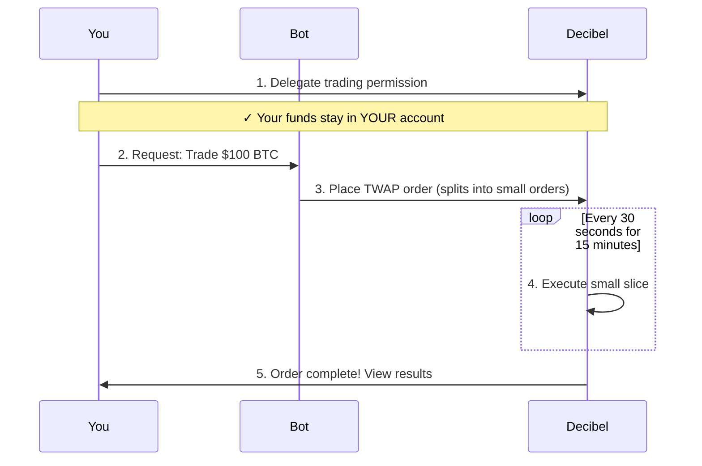

# Decibrrr - Simple Flow Diagram

## How It Works (Simple Version)

## What Happens Under the Hood

## Security: What Bot Can/Cannot Do

| Bot CAN ✅ | Bot CANNOT ❌ |
|-----------|--------------|
| Place trades | Withdraw your USDC |
| Cancel trades | Transfer funds |
| Execute TWAP orders | Close your account |
| Monitor positions | Access your wallet |

**Your private keys stay with YOU. Bot only has trading permission.**

---

For detailed diagrams, see [ARCHITECTURE_DIAGRAMS.md](./ARCHITECTURE_DIAGRAMS.md)
